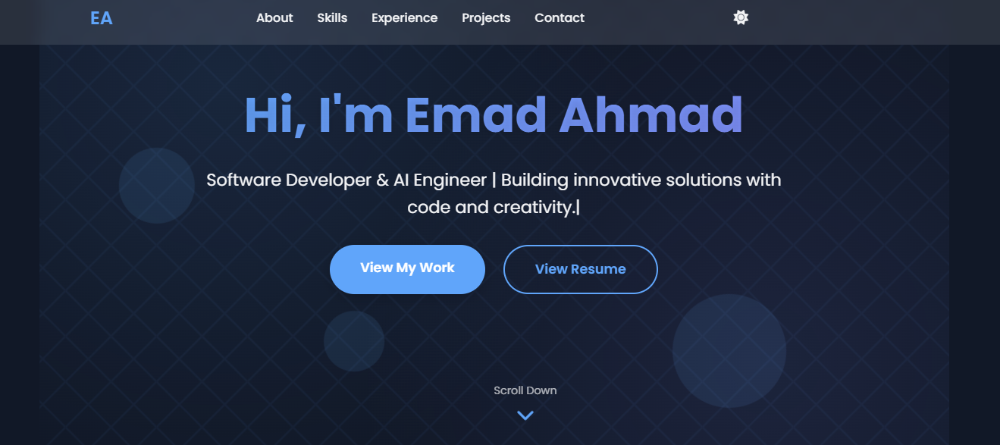

# 🌃 Emad Ahmad - Cyberpunk Portfolio



A responsive cyberpunk-themed portfolio showcasing my skills, projects, and experience. Built with pure HTML/CSS/JS with performance optimizations and mobile-first design.

## 🚀 Key Features

### 🏙️ Cyberpunk Visual Experience
| Feature | Description |
|---------|-------------|
| **Dynamic Skyline** | CSS-generated neon cityscape with parallax scrolling |
| **Digital Rain** | Interactive matrix-style animation with ripple effects |
| **Neon UI** | Glowing buttons, cards with animated borders |
| **Terminal Console** | Live system log in footer with rotating messages |
| **Theme Toggle** | Switch between dark (cyberpunk) and light modes |

### ⚡ Performance Optimizations
- **60 FPS animations** using CSS `will-change` and `transform`
- **Reduced motion mode** for accessibility
- **Debounced scroll effects** to prevent jank
- **Mobile-optimized** skyline (simplified on small screens)

### 📱 Fully Responsive
- Perfectly adapted for all devices (no horizontal scrolling)
- Touch-friendly navigation
- Mobile-specific simplifications:
  - Reduced particle count in animations
  - Stacked grid layouts
  - Larger tap targets

## 🛠️ Technologies Used
- **Frontend**: HTML5, CSS3, Vanilla JavaScript
- **Fonts**: [Orbitron](https://fonts.google.com/specimen/Orbitron) (Cyberpunk) + [Rajdhani](https://fonts.google.com/specimen/Rajdhani)
- **Icons**: [Font Awesome 6](https://fontawesome.com/)
- **Hosting**: [Netlify](https://www.netlify.com/)

## 🖥️ Local Setup
```bash
git clone https://github.com/emadahmad2001/Personal-Website.git
cd Personal-Website
# Open index.html in your browser