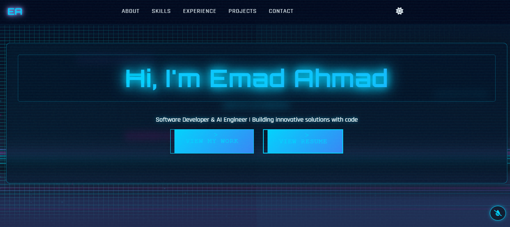

# Emad Ahmad - Portfolio Website



Welcome to my personal portfolio website! This project showcases my skills, experience, and projects as a Software Developer and AI Engineer. The website is designed to be **modern, responsive, and user-friendly**, with a clean aesthetic and smooth interactivity.

## 🌟 Features

- **Modern Design**: Sleek and minimalistic layout with a dark/light theme toggle.
- **Fully Responsive**: Optimized for all devices (desktop, tablet, mobile).
- **Interactive Elements**: Smooth scrolling, hover effects, and animations.
- **Sections**:
  - **About Me**: A brief introduction to who I am and what I do.
  - **Skills**: A showcase of my technical skills and tools.
  - **Experience**: A timeline of my professional experience.
  - **Projects**: Highlighting my best work with descriptions and links.
  - **Contact**: A form for inquiries and links to my social profiles.

## 🛠️ Technologies Used

- **Frontend**: HTML5, CSS3, JavaScript
- **Icons**: [Font Awesome](https://fontawesome.com/)
- **Fonts**: [Google Fonts](https://fonts.google.com/)
- **Deployment**: [Netlify](https://www.netlify.com/)

## 🚀 Getting Started

### Prerequisites

- A modern web browser (e.g., Chrome, Firefox, Safari).
- A code editor (e.g., VS Code, Sublime Text).

### Installation

1. Clone the repository:
   ```bash
   git clone https://github.com/emadahmad2001/Personal-Website.git